# E_voting_Blockchain

This is an evoting system using hyperledger fabric.It provides voters and election candidates a fair election process.

# Prerequisites: (Git, Curl, Docker, Docker-compose)

# Install Hyperledger Fabric, Vs Code, Webstorm 

# Starting Blockchain Test Network and Install E_voting_Blockchain Chaincode

cd $HOME/fabric-samples/test-network

# Start Test Network
./network.sh down && ./network.sh createChannel -ca -c mychannel -s couchdb

# Downloading E_voting_Blockchain

cd $HOME/fabric-samples

git clone https://github.com/sani-1023/E_voting_Blockchain

# necessary library installation

cd $HOME/fabric-samples/E_voting_Blockchain/chaincode-javascript
npm install

cd $HOME/fabric-samples/E_voting_Blockchain/application-javascript
npm install

cd $HOME/fabric-samples/E_voting_Blockchain/application-javascript 
 npm i cookie-parser --save

cd $HOME/fabric-samples/E_voting_Blockchain/application-javascript

npm install -g nodemon

cd $HOME/fabric-samples/E_voting_Blockchain/application-javascript 

npm install --save express

# Deleting the existing wallet from previous test network
rm -rf $HOME/fabric-samples/E_voting_Blockchain/application-javascript/wallet

# Install Chaincode
./network.sh deployCC -ccn evoting -ccp $HOME/fabric-samples/E_voting_Blockchain/chaincode-javascript/ -ccl javascript

# Starting E_voting_Blockchain API

cd $HOME/fabric-samples/E_voting_Blockchain/application-javascript

npx nodemon index.js

# Viewing Blockchain State in CouchDB

You can view the current state at http://localhost:5984/_utils/.

Username: admin
Password: adminpw

# For frontend

cd $HOME/fabric-samples/E_voting_Blockchain/frontend-javascript

npm run dev -- -p 3001

open the browser & go to http://localhost:3001 to view the UI.

# project structure:

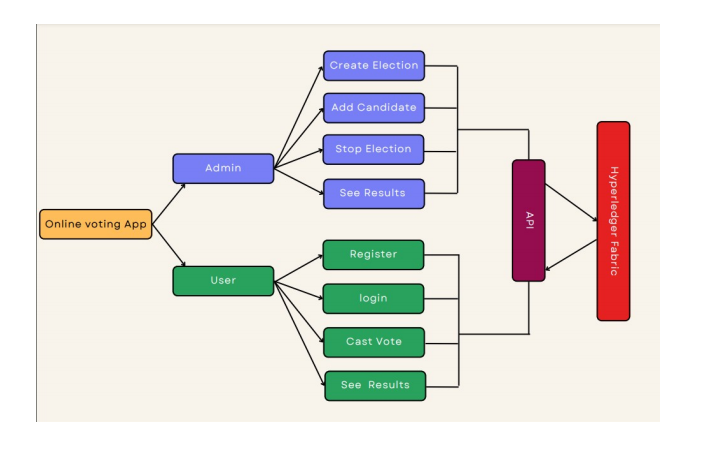 

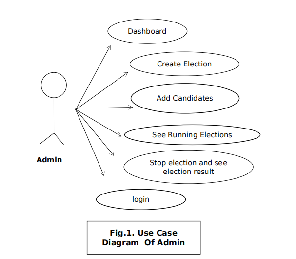 

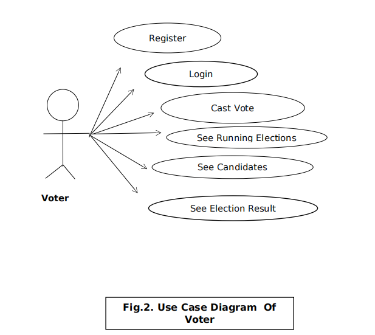 

# Some Screenshots of the projects:

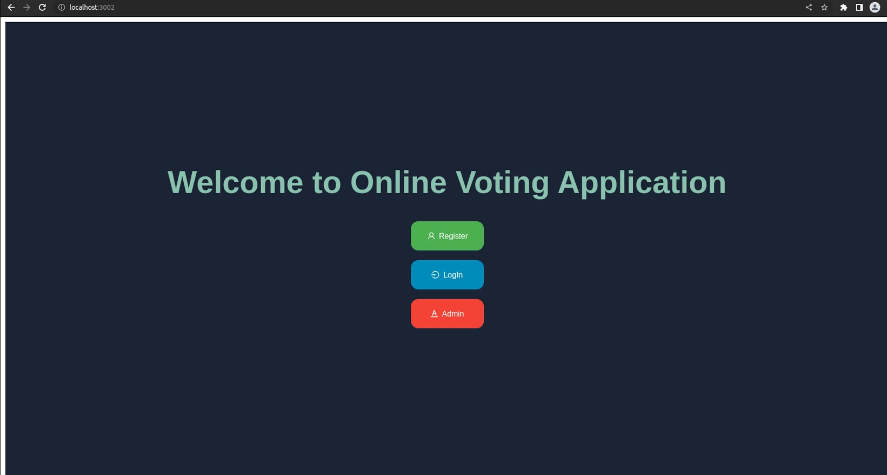 

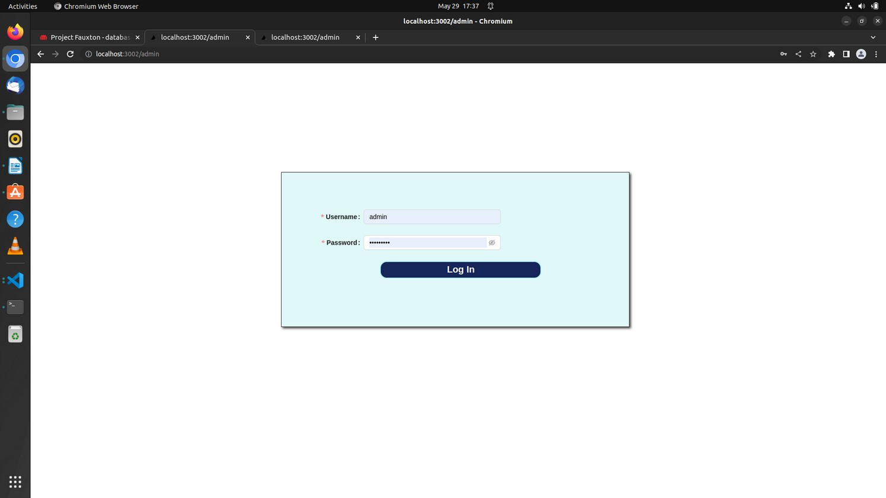 

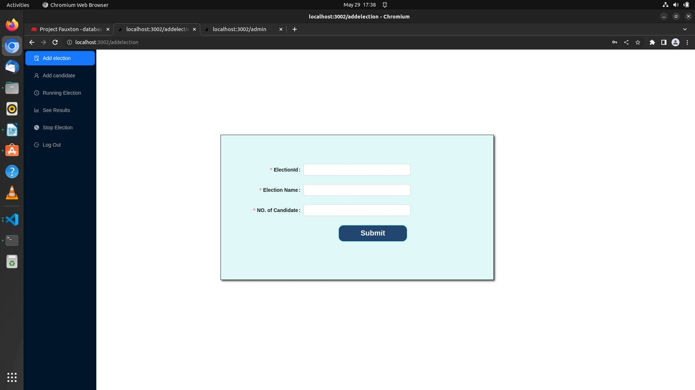 

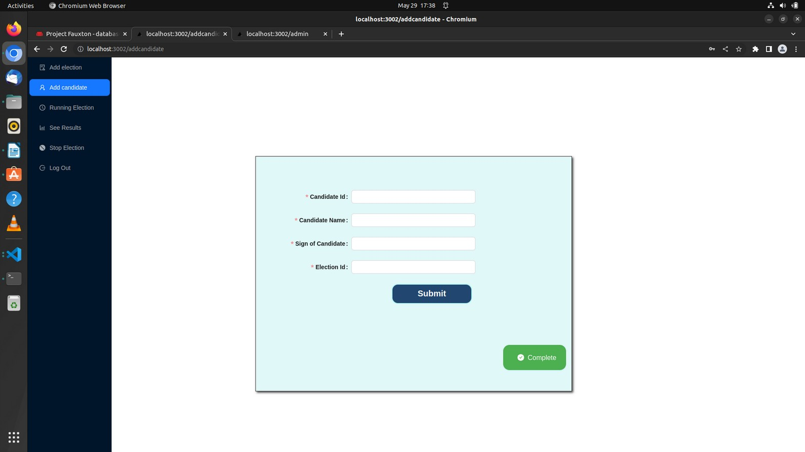 

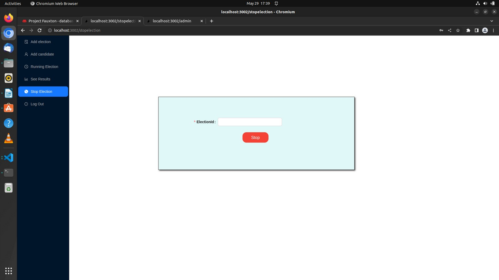 

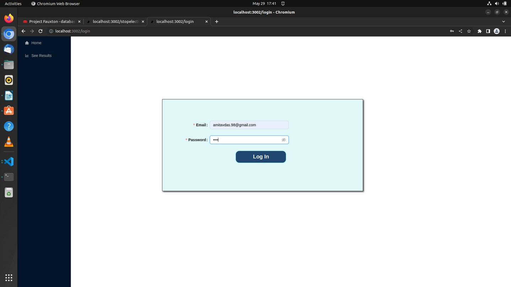 

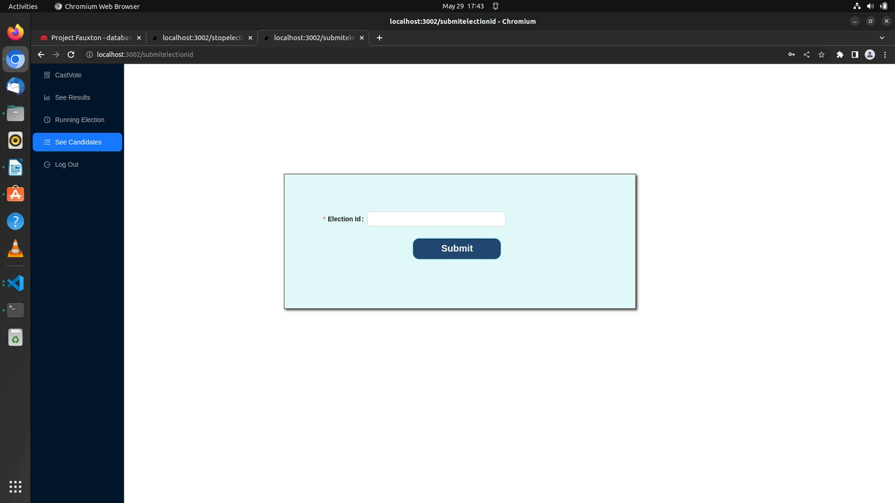 

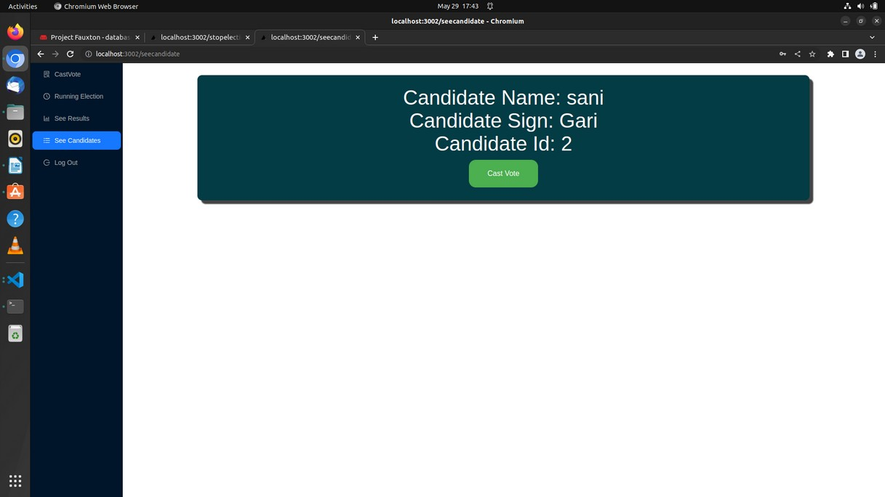 

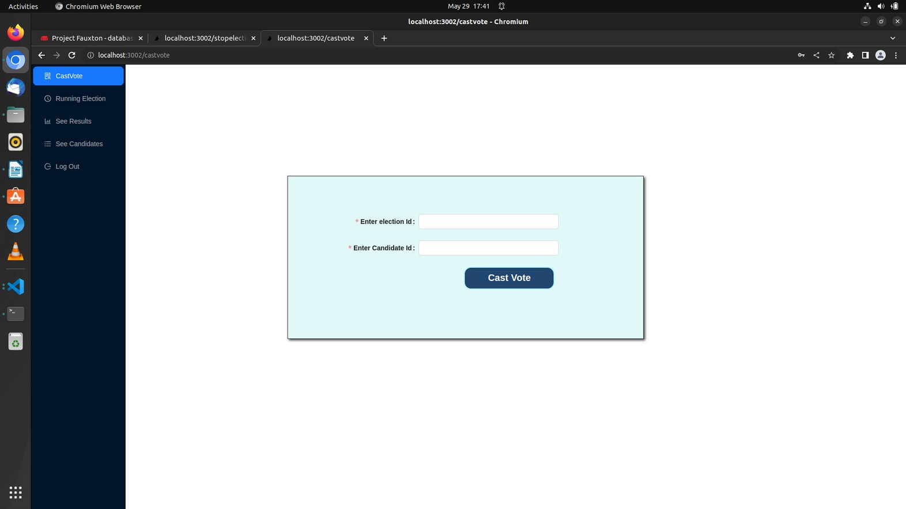 

This is developed by https://github.com/ABHISHEK-DEY-64150  & https://github.com/sani-1023
